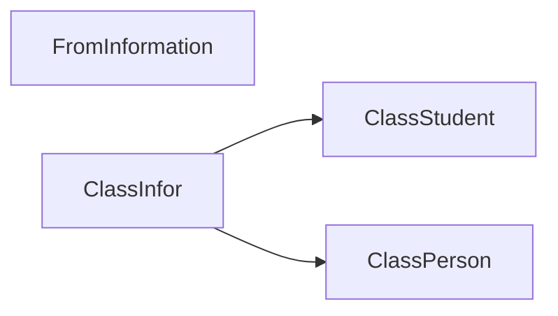

# Final
ความเป็นมาของโปรแกรม
      ปัจจุบันตามหอพักรวมจะมีให้เลือกแค่ชั้นและห้อง ปัญหาที่เกิดตามมาคือการเลือกจองเตียงกันไม่ได้ถ้าใครมาก่อนก็ได้เลือกก่อน สาเหตุคือเมื่อเราจองห้องเสร็จแล้วก็อยากจองเตียงที่เราอยากอยู่ไว้ก่อน และแก้ไข้ได้โดยการจัดทำฟอร์มและเขียนโค้ดเพื่อแก้ไขปัญหา ดิฉันจึงประสงค์จัดทำโปรแกรมนี้ขึ้นมา

วัตถุประสงค์ของโปรแกรม
1.เพื่อทบทวนการเขียนโปรแกรมและศึกษาจากปัญหา
2.เพื่อแก้ไขปัญหาการจองพื้นที่ส่วนตัวในห้อง
3.เพื่อพัฒนาในด้านการเขียนโปรแกรมครั้งต่อไป

โครงสร้างของโปรแกรม (Class diagram) ของโปรแกรม ใช้ Mermaid ในการเขียน ตัวอย่าง การเขียน Classdiagram ใน Markdown

ชื่อของผู้พัฒนาโปรแกรม
นางสาวรามิล ไกยบุตร 653450297-4

